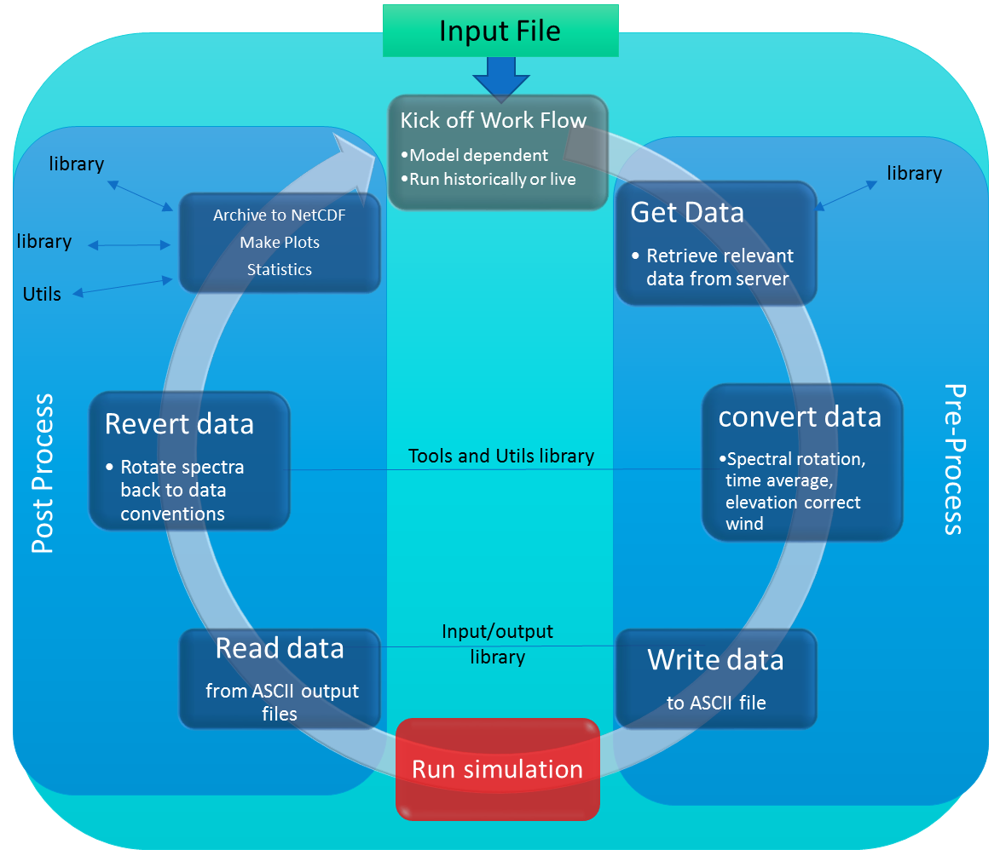

======================
Get to Know the Basics
======================

Here is where we start to get into the structure of the work flow

The operational portion of the test bed is built in Python 2.7.  We are aware that python2 is deprecated in 2020.
We are currently moving towards python 3, but would welcome any help in doing so.

The workflow is comprised of 3 basic steps and is outlined in the figure below:

- Data/process wrapper functions

  #) Setup

    - Gets data (get data submodule)
    - pre-process data to format model expects (frontback)
    - writes data to input formats expected by 'modelX' (prepdata/inputoutput.py)

  #) Run model

    - run nested (if applicable)

  #) Post Process

    - parse output files (prepdata/inputoutput.py)
    - Massage data back to established data formats (frontback)
    - create NetCDF output (makenc.py)
    - Create Runs plots  (plotting)

      - Run statistics
      - output plots 

this is the overarching architecture used in the test bed
Each uses tools that are located with (hopefully) some rhyme and reasons
Each will be explained throughout this tutorial!  Smile you're having fun!
