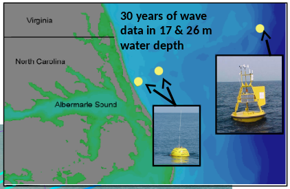
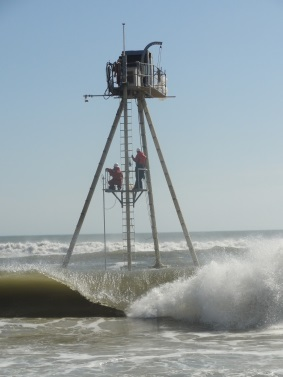
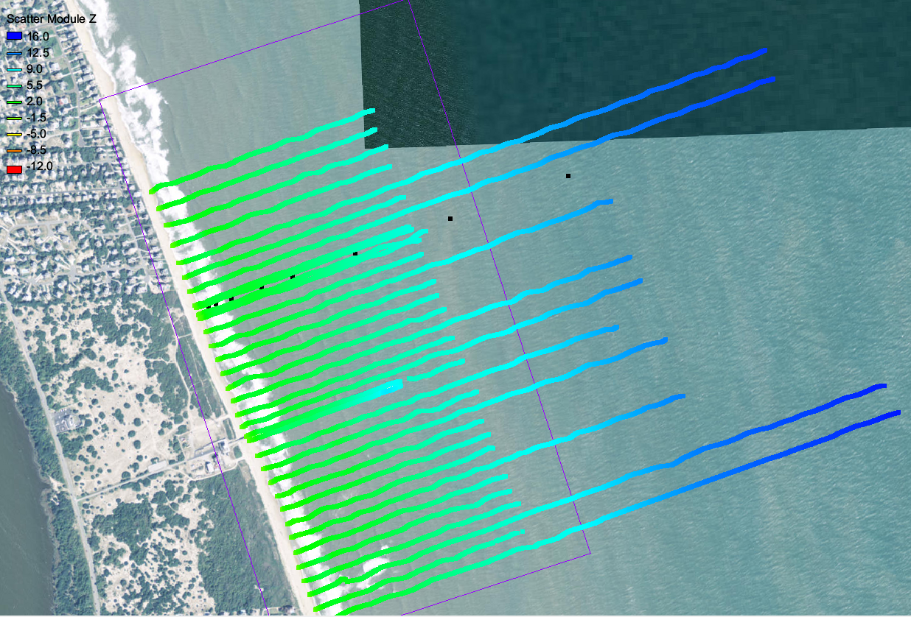
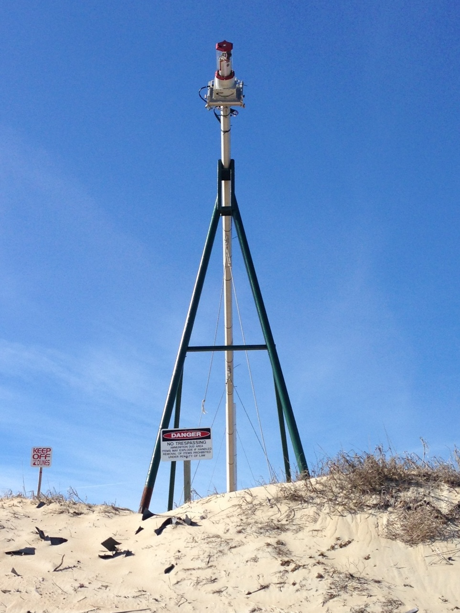
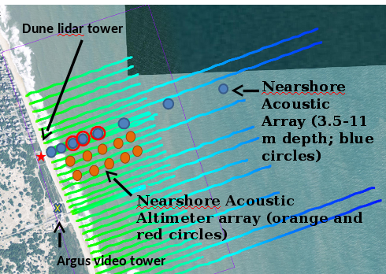

=====================
FRF Data Introduction
=====================
.. contents:: the tiny table of contents

About
-----------------
the test bed is  a framework developed in python aimed at providing validation
and testing for various physical conditions, parameterizations by running models in near-real time
and validataing data against the FRF's vast data collection capabilities

FRF Data
--------

The frf has a vast collection of data which has been collected for years.  In this picture, a summary of the FRF
data is shown.  The expanded profile lines shown are colored by water depth measured.  The `Cross-shore array`_ of wave
gauges are shown in blue, with co-located altimeters in red with the `Dune lidar tower`_ as the red star.
The new `Altimeters`_ array is shown in orange with the `Argus video tower`_ as the yellow x.

    |dataSummary|

Bathymetery
===========
The FRF has been collecting bathymetry data for 30 years using the LARC, the CRAB and various geodimeters
starting in 1977, approximately monthly recently the profile collection added 4 lines to the north, ensuring bathymetry
captured for waves approacing from the north.

|crab|
The Coastal Research Ampibious Buggy has been used at the FRF as a survey and work platform.

|bathyLines|

The FRF profile lines are shown in color with shallower regions in green and deeper in blue with a focus around
the cross-shore array with black dots.

The FRF local coordinate with the y-axis oriented alongshore (17.7º counter clockwise from true north) and
the origin located at the southern edge of the property (36.1776º N and 75.7497º W). The 1-km alongshore
property fronts the Atlantic Ocean and a 560-m-long FRF research pier extends to 6-m nominal water
depth in the center of the property (515 m),

TODO insert picture here

Dune lidar tower
================
new hot product
    - beach topography (hourly)
    - wave runup timeseries (hourly)
    - foreshore slope (hourly)
    - inner surf zone waves (hourly)

    |lidarPic|

Argus video tower
=================
argus is a video tower than can provide the following
    - timex (sand bar position)
    - cbathy (bathy inversion)
    - run up along the beach (combine with beach topogrophy to get runup elevations)

see holman et al 2007

The image below shows the individual cameras that are used to comprise the

    .. image:: images/observations/argusImagery.png

Cross-shore array
=================
the FRF has a cross-shore array of wave and current measurements, starting with off shore collection at
ndbc buoy (44014) at the continental shelf.  In addition to that there are 2 waverider buoys
collecting directional wave data at 26 meters (10 nm offshore) and at 17m (2 nm offshore) all the way to a nominal
depth of 3.5 m with the aquadopp.  Inshore of that burried pressure sensors are used. The data collection is 17 minutes
at 2 hertz for waves at the top of each hour, every three hours there is a current profile taken from the acoustic
current gauges.

`FRF Data`_
.. the above is supposed to refer a link to the summary image

=============   =============  ==============  ==================  =================
                         Cross-Shore array of wave gauges
------------------------------------------------------------------------------------
Name            Nominal depth  Gauge type      approx cross shore  approx Alongshore
=============   =============  ==============  ==================  =================
waverider-26m   26 m           waverider buoy       16,266 m           4,136 m
waverider-17m   17 m           waverider buoy       3,716 m            1,417 m
Awac-11m        11 m           AWAC                 1,272 m            910 m
AWAC-8m         8 m            AWAC                  DEAD               DEAD
8m-array        8 m            pressure array       1,917 m            938 m
AWAC-4.5m       4.5 m          AWAC                 500 m              935 m
adop-3.5m       3.5 m          Aquadopp             360 m              940 m
xp200m          ~?             paros pressure       200 m              940 m
xp150m          ~?             paros pressure       150 m              940 m
xp125m          ~?             paros pressure       125 m              940 m
=============   =============  ==============  ==================  =================

New gauges are always coming so stay tuned and ask questions

Altimeters
==========
The acoustic altimeters used at the frf are mounted on a pip, and surveyed in to position.  These instruments provide a
full profile of back scatter and a custom algorithm has been developed to track the bottom elevation data between
bathymetric surveys.  an example is shown below, where the light blue are during storms.  the black line is the bottom
tracing algorithm and the blues to yellows reflect low to high backscatter values, respectively.

    |Altimeter|
    Acoustic altimeters provide full backscatter to allow for elevation change measurements during storms

.. |Altimeter| image:: images/observations/Altimeter.png

