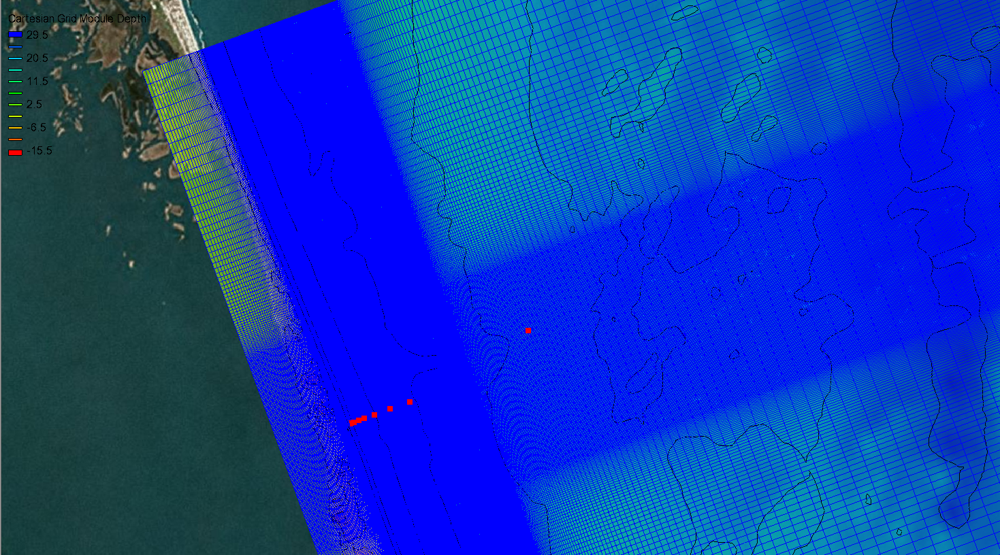
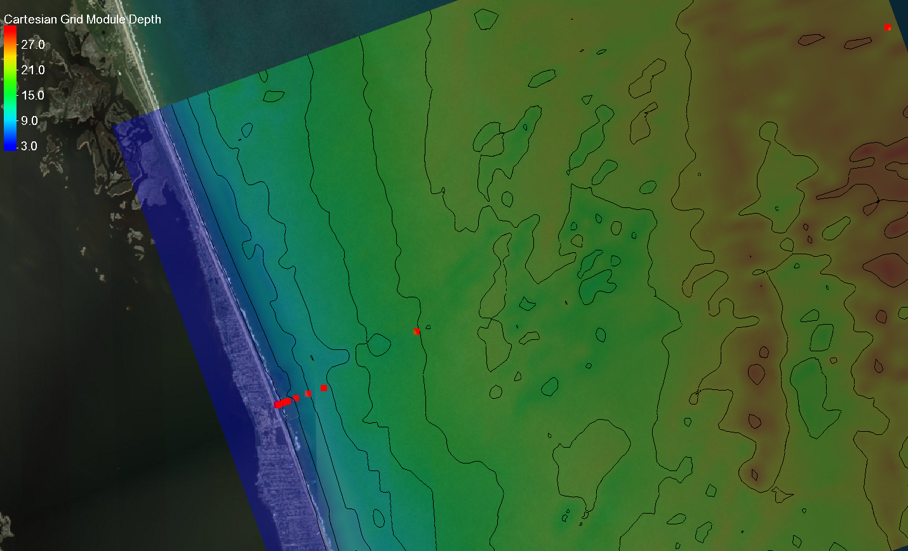

====================
CMS-WAVE Model Setup
====================

The CMS wave model is setup in a regular grid with variable sized cells in both cross-shore and alongshore directions.

    This is the model grid with variable spaced grid cells with the highest resolution near the FRF property.
    The station locations are in red.

Model Parameters
________________

Inital model setup has been documented in this CHL technote as with planned every model. The purpose of this
page is update any of the small changes and explain things that might need updating since the initial publication.

+---------+-------+--------------------------------------------------------------------+-------------------------------------------------------+
|Setting  | Value | Switch Description                                                 | Notes                                                 |
+=========+=======+====================================================================+=======================================================+
|iprp     |  -1   | Propagation and wave generation                                    |  run with both wind/wave generation and in fast mode  |
+---------+-------+--------------------------------------------------------------------+-------------------------------------------------------+
|icur     |   0   | Wave/current interaction                                           |  off                                                  |
+---------+-------+--------------------------------------------------------------------+-------------------------------------------------------+
|ibrk     |   0   | Wave breaker file                                                  |  Currently off, plans to implement                    |
+---------+-------+--------------------------------------------------------------------+-------------------------------------------------------+
|irs      |   0   | Radiation stress output                                            |  Currently off, plans to implement                    |
+---------+-------+--------------------------------------------------------------------+-------------------------------------------------------+
|kout     |  10   | Number of spectral output locations                                |  One at each of the cross-shore array of wave gauges  |
+---------+-------+--------------------------------------------------------------------+-------------------------------------------------------+
|ibnd     |   0   | Nesting boundary input                                             |  off                                                  |
+---------+-------+--------------------------------------------------------------------+-------------------------------------------------------+
|iwet     |   0   | Wetting/drying                                                     |  Controlled with water level                          |
+---------+-------+--------------------------------------------------------------------+-------------------------------------------------------+
|ibf      |   1   | Bottom friction                                                    |  Darcy-Weisbach type (Cf)                             |
+---------+-------+--------------------------------------------------------------------+-------------------------------------------------------+
|iark     |   1   | Forward reflection                                                 |  on                                                   |
+---------+-------+--------------------------------------------------------------------+-------------------------------------------------------+
|iarkr    |   0   | Backward reflection                                                |  off                                                  |
+---------+-------+--------------------------------------------------------------------+-------------------------------------------------------+
|akap     |   4   | Diffraction intensity                                              |  4 is maximum diffraction                             |
+---------+-------+--------------------------------------------------------------------+-------------------------------------------------------+
|bf       | 0.005 | Friction factor                                                    |  Spatially constant                                   |
+---------+-------+--------------------------------------------------------------------+-------------------------------------------------------+
|ark      |  0.3  | Constant forward reflection factor                                 |  1 is maximum                                         |
+---------+-------+--------------------------------------------------------------------+-------------------------------------------------------+
|arkr     |  0.3  | Constant backward reflection factor                                |  1 is maximum, (turned off)                           |
+---------+-------+--------------------------------------------------------------------+-------------------------------------------------------+
|iwvbk    |   0   | Wave breaker selection criteria                                    |  Extended Goda selected (Goda, 1975)                |
+---------+-------+--------------------------------------------------------------------+-------------------------------------------------------+
|nonln    |   0   | Non-linear wave interaction                                        |  off                                                  |
+---------+-------+--------------------------------------------------------------------+-------------------------------------------------------+
|igrav    |   0   | Infragravity wave                                                  |  off                                                  |
+---------+-------+--------------------------------------------------------------------+-------------------------------------------------------+
|irunup   |   0   | Wave runup                                                         |  off                                                  |
+---------+-------+--------------------------------------------------------------------+-------------------------------------------------------+
|imud     |   1   | Mud effect                                                         |  off                                                  |
+---------+-------+--------------------------------------------------------------------+-------------------------------------------------------+
|iwind    |   1   | Wind input                                                         |  Spatially constant                                   |
+---------+-------+--------------------------------------------------------------------+-------------------------------------------------------+
|isolv    |   0   | Solver selection                                                   |  Gauss-Seidel solver                                  |
+---------+-------+--------------------------------------------------------------------+-------------------------------------------------------+
|ixmdf    |   0   | Input/output selection                                             |  ASCII format                                         |
+---------+-------+--------------------------------------------------------------------+-------------------------------------------------------+
|iproc    |   1   | Number of processors                                               |  Currently run in serial                              |
+---------+-------+--------------------------------------------------------------------+-------------------------------------------------------+
|iview    |   0   | Half/full plane mode                                               |  Run in half-plane mode                               |
+---------+-------+--------------------------------------------------------------------+-------------------------------------------------------+
|iroll    |   0   | wave roller intensity factor (0 for no effect, 4 for strong effect)|   optional                                            |
+---------+-------+--------------------------------------------------------------------+-------------------------------------------------------+

