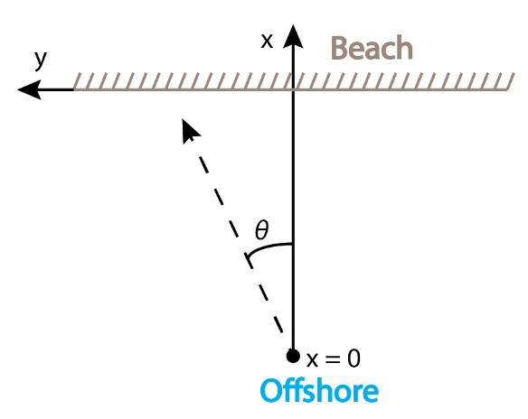
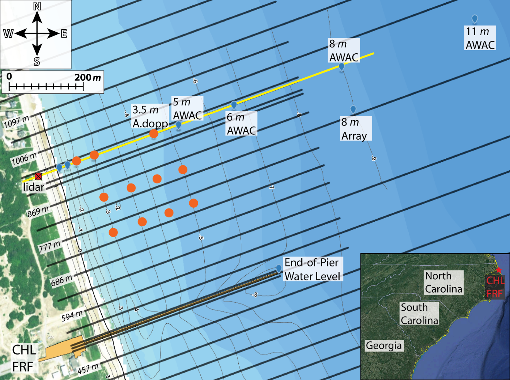

==================
CSHORE Model Setup
==================

Inital model setup has been documented in this CHL technote as with planned every model. The purpose of this
page is update any of the small changes and explain things that might need updating since the inital publication.

Young, David, A. Spicer Bak, Bradley D. Johnson. 2018. Initialization and
setup of the coastal model test bed: CSHORE. ERDC/CHL CHETN-I-XX.
Vicksburg, MS: U.S. Army Engineer Research and Development Center.
http://chl.erdc.usace.army.mil/chetn

|CSHOREgif|

Domain Setup
____________

The CSHORE domain assumes a shore-perpendicular (cross-shore) transect with uniform grid spacing,
with the origin offshore (x=0) and positively increasing with distance onshore (Figure 1).  A foundational
assumption of CSHORE is alongshore uniformity, although obliquely incident waves and longshore currents are
included.  The governing equations are a combination of the time-averaged, depth-integrated continuity,
cross-shore and alongshore momentum, wave action, and roller energy equations.

|CSHOREdomain|

|CSHOREexampleLine|
The black lines are the measure profile lines. The red circles are acoustic altimeter positions that are used for
validation while the wave and current gauges are shown with blue pins.

Model setup's running
_____________________

The test bed is great at running multiple models with multiple setups to get a better understanding on how different setups
can affect model performance.  This is often done in the work flow through the use of the 'version_prefix' which controls
various switches in the models.

   =================  ===================  ====================================================================
     version Prefix   Settings Affected    Notes
   =================  ===================  ====================================================================
        'FIXED'         iprofl             Bed evolution toggled off.  Bathymetry from latest survey data.
        'MOBILE'        iprofl             Bed evolution toggled on.  Bathymetry from previous days run.
     'MOBILE_RESET'     iprofl             Bed evolution toggled on.  Bathymetry reset after new survey.
   =================  ===================  ====================================================================

Input Parameters
________________
The following table lists the parameters of interest that are input to the model with notes on each
                   'iline': 1,  # single line
                   'itide': 0,  # 0 = no tidal effect on currents
                   'sporo': 0.4,  # sediment porosity

+------------+-------+-------------------------------------------------------+------------------------------------------------------------------------------+
|Setting     | Value | Switch Description                                    | Notes                                                                        |
+============+=======+=======================================================+==============================================================================+
|iline       |    1  | Number of Lines                                       |  0 - off, 1 - on.                                                            |
+------------+-------+-------------------------------------------------------+------------------------------------------------------------------------------+
|iprofl      |  0/1  | Toggle to run bed evolution                           |  0 - off, 1 - on.                                                            |
+------------+-------+-------------------------------------------------------+------------------------------------------------------------------------------+
|isedav      |   0   | Sand availability parameter.                          |  0 - unlimited sand, 1 - hard bottom                                         |
+------------+-------+-------------------------------------------------------+------------------------------------------------------------------------------+
|iperm       |   0   | Bed permiability parameter.                           |  0 - impermeable bed, 1 - permeable bottom                                   |
+------------+-------+-------------------------------------------------------+------------------------------------------------------------------------------+
|iover       |   1   | Overtopping parameter.                                |  0 - no overtopping, 1 - allow overtopping                                   |
+------------+-------+-------------------------------------------------------+------------------------------------------------------------------------------+
|iwtran      |   0   | Toggle for wave transmission over dune crest.         |  0 - no wave transmission, 1 - wave transmission from overtopping            |
+------------+-------+-------------------------------------------------------+------------------------------------------------------------------------------+
|ipond       |   0   | Toggle got ponding seawards of still water level.     |  0 - no ponding, 1 - allow ponding                                           |
+------------+-------+-------------------------------------------------------+------------------------------------------------------------------------------+
|infilt      |   0   | Infiltration landward of dune crest parameter.        |  0 - no infiltration, 1 - allow infiltration                                 |
+------------+-------+-------------------------------------------------------+------------------------------------------------------------------------------+
|iwcint      |   0   | Wave-current interaction toggle.                      |  0 - no wave-current interaction, 1 - wave-current interaction               |
+------------+-------+-------------------------------------------------------+------------------------------------------------------------------------------+
|iroll       |   0   | Wave roller toggle.                                   |  0 - turn off wave rollers, 1 - turn on wave rollers                         |
+------------+-------+-------------------------------------------------------+------------------------------------------------------------------------------+
|iwind       |   0   | Wind effect toggle.                                   |  0 - no wind effect, 1 - turn on wind effect                                 |
+------------+-------+-------------------------------------------------------+------------------------------------------------------------------------------+
|itide       |   0   | Tide effect on currents toggle.                       |  0 - no tide effect, 1 - turn on tide effect                                 |
+------------+-------+-------------------------------------------------------+------------------------------------------------------------------------------+
|iveg        |   0   | Vegetated bed toggle.                                 |  0 - non-vegetated bed, 1 - vegetated bed                                    |
+------------+-------+-------------------------------------------------------+------------------------------------------------------------------------------+
|veg_Cd      |   1   | Vegetated Drag Coefficient                            |  N/A                                                                         |
+------------+-------+-------------------------------------------------------+------------------------------------------------------------------------------+
|veg_n       |  100  | Vegetation Density                                    |  N/A                                                                         |
+------------+-------+-------------------------------------------------------+------------------------------------------------------------------------------+
|veg_dia     | 0.01  | Vegetation diameter                                   |  units in meters                                                             |
+------------+-------+-------------------------------------------------------+------------------------------------------------------------------------------+
|veg_ht      | 0.20  | Vegetation height                                     |  units in meters                                                             |
+------------+-------+-------------------------------------------------------+------------------------------------------------------------------------------+
|veg_rod     | 0.1   | Vegetation erosion limit below sand for failure       |  units in meters                                                             |
+------------+-------+-------------------------------------------------------+------------------------------------------------------------------------------+
|dxc         |   1   | Model node spacing.                                   |  units - m                                                                   |
+------------+-------+-------------------------------------------------------+------------------------------------------------------------------------------+
|gamma       | 0.72  | Shallow water ratio of wave height to water depth     |  wave-breaking parameter                                                     |
+------------+-------+-------------------------------------------------------+------------------------------------------------------------------------------+
|d50         |  0.15 |    median Diameter grain size                         |  measured locally                                                            |
+------------+-------+-------------------------------------------------------+------------------------------------------------------------------------------+
|wf          |   #   |    fall velocity                                      |  calculated on each input                                                    |
+------------+-------+-------------------------------------------------------+------------------------------------------------------------------------------+
|sg          | 2.65  |    specific gravity of sediment                       |                                                                              |
+------------+-------+-------------------------------------------------------+------------------------------------------------------------------------------+
|effb        | 0.002 |    suspension efficiency due to breaking eB           |                                                                              |
+------------+-------+-------------------------------------------------------+------------------------------------------------------------------------------+
|efff        |   0   |    Suspension efficiency due to friction ef           |                                                                              |
+------------+-------+-------------------------------------------------------+------------------------------------------------------------------------------+
|nwave       |  2    |    Number of wave Records                             |                                                                              |
+------------+-------+-------------------------------------------------------+------------------------------------------------------------------------------+
|nsurge      |  #    |    Number of water level records                      |                                                                              |
+------------+-------+-------------------------------------------------------+------------------------------------------------------------------------------+
|ilab        |   1   |    controls the boundary condition timing             | 1 = time average  0 = extra input/output record, solves between input-times  |
+------------+-------+-------------------------------------------------------+------------------------------------------------------------------------------+
|rwh         |  0.01 |    numerical rununp wire height [m]                   |              Runup tuning knob                                               |
+------------+-------+-------------------------------------------------------+------------------------------------------------------------------------------+
|slpot       | 0.073 |    overtopping suspended load parameter               |                                                                              |
+------------+-------+-------------------------------------------------------+------------------------------------------------------------------------------+
|slp         |  0.5  |    suspended load parameter                           |                                                                              |
+------------+-------+-------------------------------------------------------+------------------------------------------------------------------------------+
|tanphi      | 0.63  |    tangent (sediment friction angle)                  |                                                                              |
+------------+-------+-------------------------------------------------------+------------------------------------------------------------------------------+
|blp         | 0.002 |    bedload parameter                                  |                                                                              |
+------------+-------+-------------------------------------------------------+------------------------------------------------------------------------------+
|fric_fac    | 0.015 |    friction factor                                    |       quadratic wave/current friction factor                                 |
+------------+-------+-------------------------------------------------------+------------------------------------------------------------------------------+

.. |CSHOREgif| image:: ../images/ModelSetups/CSHORE_example.gif