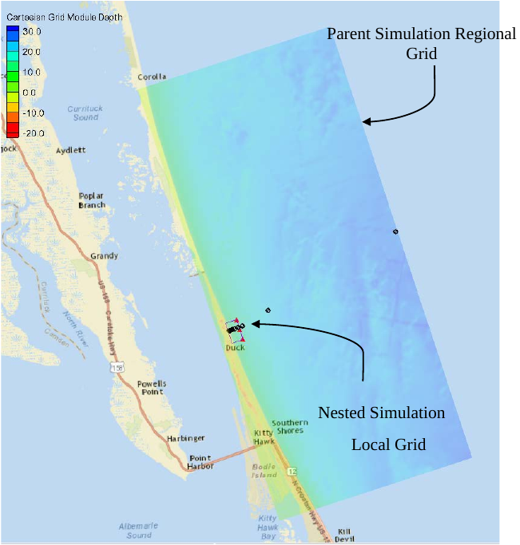
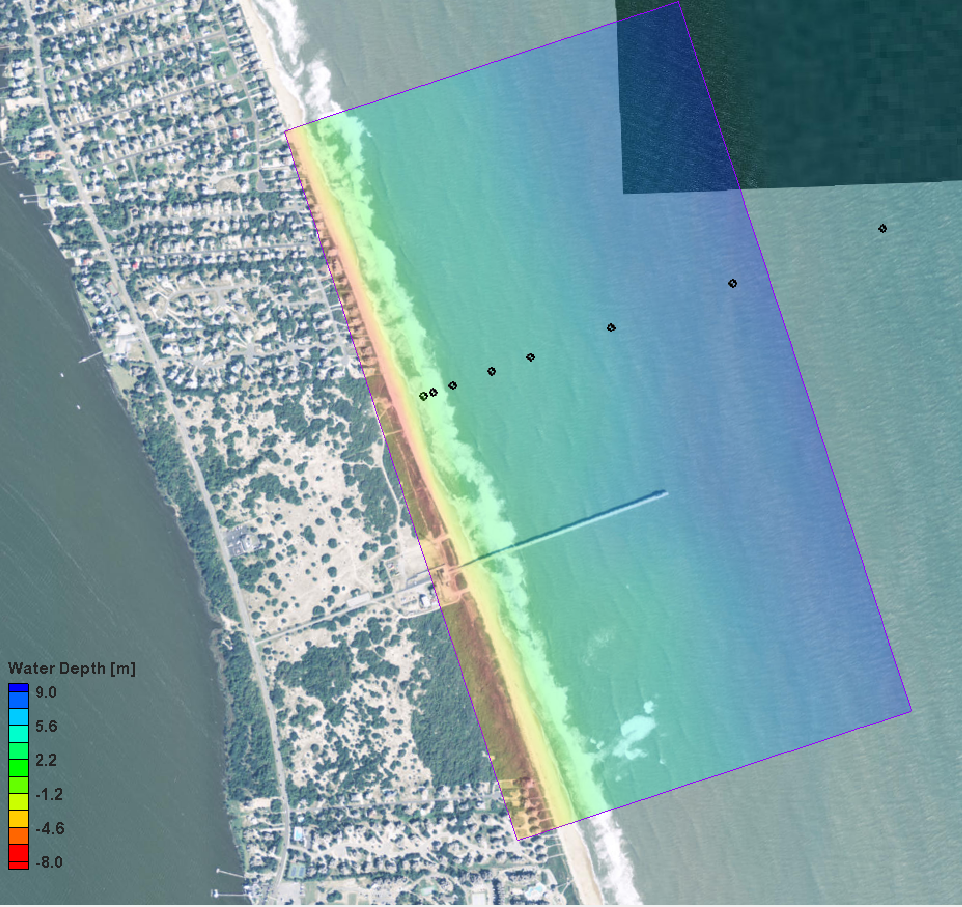

==================
STWAVE Model Setup
==================

Inital model setup has been documented in this CHL technote as with planned every model. The purpose of this
page is update any of the small changes and explain things that might need updating since the inital publication.

Bak, A. S., T. Hesser, J. M. Smith, and M. A. Bryant. 2016. Initialization and
setup of the coastal model test bed: STWAVE. ERDC/CHL CHETN-I-XX.
Vicksburg, MS: U.S. Army Engineer Research and Development Center.
http://chl.erdc.usace.army.mil/chetn

Domain Setup
____________

The STWAVE model is setup in a parent-child nested configuration at the FRF. This is outlined in the below image and runs
with a resolution of 50 m in the parent simulation

|parentNest|

The nested nearshore domain is run at 5 or 10 meter resolution depending on which version of the setup is run.

|child|
The black dots represent the locations of the cross-shore array in the model domain.

Model setup's running
_____________________

The test bed is great at running multiple models with multiple setups to get a better understanding on how different setups
can affect model performance.  This is often done in the work flow through the use of the 'version_prefix' which controls
various switches in the models.

   =================  ===================  ====================================================================
     version Prefix   Settings Affected    Notes
   =================  ===================  ====================================================================
      'HP'            iplane               standard setup, run at 5 m resolution, using measured bathymetry
      'FP'            iplane               Fullplane setup, run at 5m resolution, using measured bathymetry
      'CB'            bathy input          Uses cBathy Kalman filtered from Holman (2007) as boundary
      'CBThresh'      bathy input          Uses a thresholded cBathy Kalman filtered derived from brodie (2018)
   =================  ===================  ====================================================================

Input Parameters
________________
The following table lists the parameters that are input to the model with notes on each

+----------+-------+--------------------------------------------------------------------+-------------------------------------------------------+
|Setting   | Value | Switch Description                                                 | Notes                                                 |
+==========+=======+====================================================================+=======================================================+
|iplane    |   0   | Half and full plane description                                    |  run with both wind/wave generation and in fast mode  |
+----------+-------+--------------------------------------------------------------------+-------------------------------------------------------+
|iprp      |  -1   | Propagation and wave generation                                    |  run with both wind/wave generation and in fast mode  |
+----------+-------+--------------------------------------------------------------------+-------------------------------------------------------+
|icur      |   0   | Wave/current interaction                                           |  off                                                  |
+----------+-------+--------------------------------------------------------------------+-------------------------------------------------------+
|ibreak    |   2   | Wave breaker file                                                  |  wave dissipation per cell                            |
+----------+-------+--------------------------------------------------------------------+-------------------------------------------------------+
|irs       |   0   | Radiation stress output                                            |  Currently off, plans to implement                    |
+----------+-------+--------------------------------------------------------------------+-------------------------------------------------------+
|nselct    |  10   | Number of spectral output locations                                |  One at each of the cross-shore array of wave gauges  |
+----------+-------+--------------------------------------------------------------------+-------------------------------------------------------+
|nnest     |   0   | Nesting boundary input                                             |  off                                                  |
+----------+-------+--------------------------------------------------------------------+-------------------------------------------------------+
|nstations |   0   |      number of bulk parameter output                               |  Controlled with water level                          |
+----------+-------+--------------------------------------------------------------------+-------------------------------------------------------+
|ibnd      |   1   |         boundary condition identifier                              |   0 = single point, 1 = linear interp, 2 = morphic    |
+----------+-------+--------------------------------------------------------------------+-------------------------------------------------------+
|ifric     |   3   | Bottom friction                                                (1/2) JONSWAP (cf) (3/4) mannings n; odd=spatially constant |
+----------+-------+--------------------------------------------------------------------+-------------------------------------------------------+
|idep_opt  |   0   |                                                                    |  off                                                  |
+----------+-------+--------------------------------------------------------------------+-------------------------------------------------------+
|isurge    |   0   |  waterlevel description                                            |    constant, forced from end of pier                  |
+----------+-------+--------------------------------------------------------------------+-------------------------------------------------------+
|iwind     |   0   | wind description                                                   |  Spatially constant                                   |
+----------+-------+--------------------------------------------------------------------+-------------------------------------------------------+
|i_bc1     |  2    |  forcing boundary                                                  |                                                       |
+----------+-------+--------------------------------------------------------------------+-------------------------------------------------------+
|i_bc2     |  3    |   alongshore boundary                                              |                                                       |
+----------+-------+--------------------------------------------------------------------+-------------------------------------------------------+
|i_bc3     |   0   |   shoreline boundary                                               |                                                       |
+----------+-------+--------------------------------------------------------------------+-------------------------------------------------------+
|i_bc4     |  3    |   alongshore boundary                                              |                                                       |
+----------+-------+--------------------------------------------------------------------+-------------------------------------------------------+
|cf_const  | 0.073 |  Hanson half plane paper                                           |                                                       |
+----------+-------+--------------------------------------------------------------------+-------------------------------------------------------+

